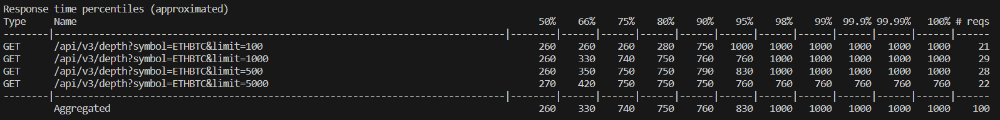

# Konomic Test Task

## Description

ТЕСТОВОЕ ЗАДАНИЕ

1. Тестирование API сайта https://testnet.binance.vision.
Описание API доступно по адресу https://binance-docs.github.io/apidocs
- 1.1. Получить данные об ордербуке (GET api/v3/depth) для пары ETHBTC. Проверить корректность полученного ответа. Проверить соответствие работы метода описанию в документации.
- 1.2. Замерить 95 перцентиль времени ответа сервера (95% latency) в зависимости от передаваемого параметра limit. Для этого максимально быстро выполнить 20 запросов для каждого из значений (100, 500, 1000, 5000), учитывая возможные лимиты на количество запросов (rate limits).
Сформулировать критерии успешности проверки. Результат должен быть снабжен инструкцией по запуску теста.
 
2. E2E тестирование поиска на сайте https://habr.com/
Протестировать поиск по сайту, при условии, что тестируемый сценарий начинается с захода пользователя на главную страницу.
Сформулировать критерии успешности проверки. Результат должен быть снабжен инструкцией по запуску теста.

## Install requirements

- `python -m venv venv`
- `venv\Scripts\activate.bat`
- `pip install -r requirements.txt`

## 1.1 Order book for ETHBTC

`pytest test_binance_api.py`

## 1.2 P95 latency measurement

Criteria:

- P95 <= 500ms - test passed
- P95 > 500ms - test failed

`locust -f locustfile.py -u 10 -t 10 --headless -i 100`

Example:

## 2 Search on habr.com

Criteria:

- status code == 200 OK - test passed
- status code != 200 OK - test failed

`pytest test_habr.py`
